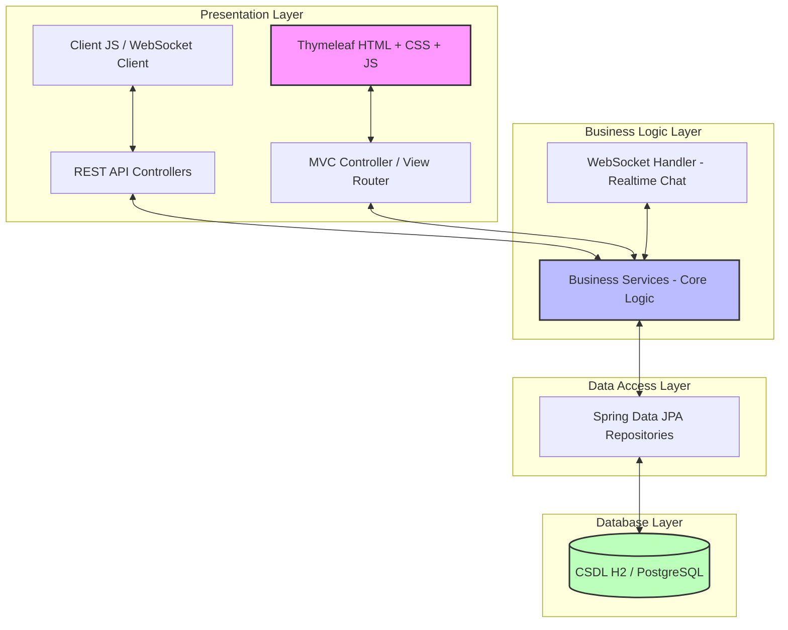
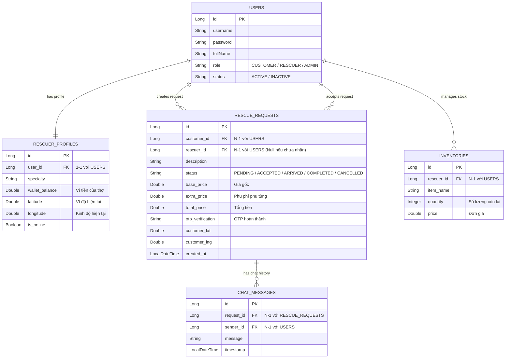

# Cẩm Nang Kiến Trúc & Bản Đồ Huấn Luyện Thực Chiến e-Rescue Platform 🗺️🚗
> **Tài liệu hướng dẫn sinh viên IT xây dựng hệ thống Cứu hộ Giao thông thông minh từ A - Z**
> *Thiết kế dành riêng cho bạn - Sinh viên Kỳ 5 FPT University - Lộ trình trở thành Senior Software Engineer*

Chào bạn! Là một người anh đi trước, một **Senior Solution Architect**, tôi rất hiểu cảm giác của một sinh viên Kỳ 5: Bạn đã học qua các môn cơ sở ngành, cơ sở dữ liệu, Java Web, nhưng khi bắt tay vào làm một dự án thực tế lớn từ đầu tới cuối (End-to-End), bạn dễ bị ngợp bởi không biết bắt đầu từ đâu, chia chức năng thế nào, và làm sao để code sạch, dễ mở rộng (Clean Code & Scalability).

Tài liệu này được viết ra để giải quyết triệt để vấn đề đó. Đây không chỉ là một tài liệu lý thuyết, mà là một **"Bản Đồ Kỹ Thuật" (Technical Blueprint)** cực kỳ chi tiết. Khi bạn đổi sang một thư mục trống mới hoặc máy tính khác, bạn chỉ cần gửi tệp tin này cho tôi (hoặc bất kỳ AI nào), tôi sẽ lập tức hiểu toàn bộ cấu trúc dự án và **cầm tay chỉ việc** hướng dẫn bạn tự tay code lại 100% dự án này.

---

## 🏗️ 1. Nguyên Tắc Thiết Kế Hệ Thống Chuẩn Công Nghiệp

Để đạt điểm tối đa khi bảo vệ đồ án (Capstone Project) và đi làm thực tế, chúng ta áp dụng mô hình **Kiến Trúc Phân Tầng (Layered Architecture)**. Đây là kiến trúc kinh điển giúp tách biệt độc lập các thành phần, cực kỳ dễ bảo trì và kiểm thử.



### 📁 Sắp Xếp Thư Mục (Package Structure)
Hãy tạo cấu trúc thư mục như dưới đây ngay khi bắt đầu dự án:
```text
src/main/java/web/rescue/erp/
├── ErpApplication.java          # Tệp khởi chạy Spring Boot
├── config/                      # Cấu hình Web, Security 6, WebSocket
├── entity/                      # Các thực thể cơ sở dữ liệu (JPA Entities)
│   └── enums/                   # Các hằng số trạng thái (Role, RequestStatus...)
├── repository/                  # Giao tiếp với Database (Spring Data JPA)
├── service/                     # Xử lý Logic nghiệp vụ (Surge Pricing, AI, Inventory...)
├── api/                         # REST API Controllers (Trả về JSON cho Ajax)
├── controller/                  # MVC Controllers (Điều hướng trang HTML)
└── websocket/                   # WebSocket Handlers (Giao tiếp thời gian thực)
```

---

## 📊 2. Mô Hình Dữ Liệu Thực Thể & Quan Hệ (Entity Relationship)

Dưới đây là sơ đồ quan hệ các bảng trong hệ thống. Hãy hiểu rõ sơ đồ này vì nó là xương sống của toàn bộ dự án:



---

## 📅 3. Lộ Trình 6 Sprint Cầm Tay Chỉ Việc

Để làm dự án thành công, chúng ta chia nhỏ công việc thành **6 Sprints**. Dưới đây là nội dung chi tiết của từng Sprint bao gồm logic nghiệp vụ và mã nguồn cốt lõi để bạn thực hiện.

### 🔴 Sprint 1: Khởi Tạo Dự Án & Thiết Kế Lõi CSDL (Database First)
* **Logic Nghiệp Vụ**: Trước khi làm giao diện hay API, ta phải định hình được thực thể dữ liệu. Việc quản lý người dùng cần phân chia rõ ràng vai trò (`Role`) và trạng thái (`UserStatus`).
* **Các tệp cần tạo**:
  1. `web.rescue.erp.entity.enums.Role` & `UserStatus`
  2. `web.rescue.erp.entity.enums.RequestStatus` (PENDING, ACCEPTED, ARRIVED, COMPLETED, CANCELLED)
  3. `web.rescue.erp.entity.RescueRequest` (Thêm các trường tọa độ GPS, OTP xác thực, chi tiết giá và thời gian hủy).

> [!TIP]
> **Code Cốt Lõi - Entity RescueRequest.java**:
> ```java
> package web.rescue.erp.entity;
> import jakarta.persistence.*;
> import lombok.*;
> import web.rescue.erp.entity.enums.RequestStatus;
> import java.time.LocalDateTime;
> 
> @Entity @Table(name = "rescue_requests")
> @Getter @Setter @NoArgsConstructor @AllArgsConstructor @Builder
> public class RescueRequest {
>     @Id @GeneratedValue(strategy = GenerationType.IDENTITY)
>     private Long id;
>     @ManyToOne @JoinColumn(name = "customer_id")
>     private User customer;
>     @ManyToOne @JoinColumn(name = "rescuer_id")
>     private User rescuer;
>     private String description;
>     @Enumerated(EnumType.STRING)
>     private RequestStatus status;
>     private Double basePrice;
>     private Double extraPrice = 0.0;
>     private Double totalPrice;
>     private String otpVerification;
>     private Double customerLatitude;
>     private Double customerLongitude;
>     private LocalDateTime createdAt;
>     private LocalDateTime acceptedAt;
>     private LocalDateTime cancelledAt;
>     private String cancelReason;
>     private String cancelledBy;
> }
> ```

---

### 🟢 Sprint 2: Bản Đồ Cứu Hộ Lân Cận & Chẩn Đoán Bằng AI (AI Diagnostic)
* **Logic Nghiệp Vụ**: Khách hàng khi gặp sự cố sẽ mô tả tình trạng xe. Ta tích hợp một mô hình AI giả lập (`AiDiagnosticService`) để phân tích từ khóa dịch vụ nhằm ước lượng hư hại và tự động định giá ban đầu. Đồng thời, dùng công thức lượng giác Haversine để tìm thợ cứu hộ trong bán kính 5km trên bản đồ **Leaflet JS**.
* **Các bước triển khai**:
  1. Viết thuật toán Haversine để tính khoảng cách giữa hai điểm tọa độ trên Trái Đất.
  2. Viết API trả về danh sách thợ cứu hộ đang Online gần khách hàng nhất.

> [!NOTE]
> **Công thức Haversine tính khoảng cách**:
> $$d = 2R \arcsin\left(\sqrt{\sin^2\left(\frac{\Delta \phi}{2}\right) + \cos(\phi_1)\cos(\phi_2)\sin^2\left(\frac{\Delta \lambda}{2}\right)}\right)$$
> Trong đó $R = 6371$ km, $\phi$ là Vĩ độ (Latitude), $\lambda$ là Kinh độ (Longitude).

---

### 🔵 Sprint 3: Định Giá Động (Surge Pricing) & WebSocket Chat Real-time
* **Logic Nghiệp Vụ**: 
  - **Surge Pricing (Định giá động)**: Khi khách gọi cứu hộ vào đêm khuya (22h - 5h), hệ thống tự động nhân hệ số **1.2x** và cộng thêm **50,000đ** phụ phí hỗ trợ thợ đi đêm.
  - **WebSocket Chat**: Cho phép khách hàng và thợ nhắn tin thương lượng trực tiếp mà không cần tải lại trang. WebSocket kết nối theo từng luồng sự cố cứu hộ (`requestId`) thông qua biểu thức Regex đường dẫn `/ws/chat/{requestId}`.

> [!TIP]
> **Code Cốt Lõi - WebSocket Handler (RescueWebSocketHandler.java)**:
> ```java
> package web.rescue.erp.websocket;
> import org.springframework.web.socket.*;
> import org.springframework.web.socket.handler.TextWebSocketHandler;
> import java.util.*;
> import java.util.concurrent.ConcurrentHashMap;
> 
> public class RescueWebSocketHandler extends TextWebSocketHandler {
>     // Lưu trữ các Session theo requestId để gửi tin nhắn chính xác
>     private final Map<String, List<WebSocketSession>> roomSessions = new ConcurrentHashMap<>();
> 
>     @Override
>     public void afterConnectionEstablished(WebSocketSession session) {
>         String path = session.getUri().getPath();
>         String requestId = path.substring(path.lastIndexOf('/') + 1);
>         roomSessions.computeIfAbsent(requestId, k -> new ArrayList<>()).add(session);
>     }
> 
>     @Override
>     protected void handleTextMessage(WebSocketSession session, TextMessage message) throws Exception {
>         String path = session.getUri().getPath();
>         String requestId = path.substring(path.lastIndexOf('/') + 1);
>         List<WebSocketSession> sessions = roomSessions.get(requestId);
>         if (sessions != null) {
>             for (WebSocketSession s : sessions) {
>                 if (s.isOpen()) {
>                     s.sendMessage(message);
>                 }
>             }
>         }
>     }
> }
> ```

---

### 🟡 Sprint 4: Cốp Đồ Nghề Di Động (Mobile Inventory) & VietQR Thanh Toán Động
* **Logic Nghiệp Vụ**:
  - **Cốp đồ nghề (Inventory)**: Mỗi người thợ có một thùng đồ nghề trên xe máy/ô tô cứu hộ. Khi thay săm, lốp hay bugi cho khách, thợ chọn phụ tùng trực tiếp từ danh sách cốp đồ nghề. Hệ thống tự động trừ kho của thợ và cộng số tiền phụ tùng đó vào hóa đơn (`extraPrice`), minh bạch hóa chi phí, tránh thợ "chém giá" khách hàng.
  - **VietQR động**: Hệ thống tự động tạo ảnh mã QR chứa tài khoản Admin, số tiền chính xác cần thanh toán (`totalPrice`), và mã giao dịch để khách hàng quét quét app ngân hàng thanh toán cực nhanh.

> [!IMPORTANT]
> **Cách tạo mã VietQR Động không cần SDK**:
> Bạn chỉ cần gọi API mở của VietQR qua thẻ `` cực kỳ gọn nhẹ:
> `https://img.vietqr.io/image/MB-123456789999-qr_only.png?amount=150000&addInfo=Rescue_Request_12`

---

### 🟣 Sprint 5: Phí Phạt Hủy Cuốc, Ví Tiền & Báo Cáo Doanh Thu 3 Tháng
* **Logic Nghiệp Vụ**:
  - **Phí phạt hủy cuốc (Cancellation Policy)**: Để bảo vệ quyền lợi của thợ (đã tốn xăng chạy đi), nếu khách hàng hủy cuốc sau khi thợ đã nhận cuốc được trên **2 phút**, khách hàng sẽ bị phạt **20,000đ**. Số tiền phạt này được cộng thẳng vào ví của thợ (`walletBalance`).
  - **Quản lý ví & Doanh thu**: Thợ có thể xem tổng tiền làm ra, tiền thực nhận (90% sau khi trừ chiết khấu 10% cho hệ thống) và biểu đồ doanh thu trong 3 tháng gần nhất để dễ dàng theo dõi thu nhập của mình.

> [!TIP]
> **Thuật toán xử lý Hủy cuốc (trong RescueRequestService.java)**:
> ```java
> public RescueRequest cancelRequest(Long requestId, String cancelledBy, String reason) {
>     RescueRequest req = repository.findById(requestId).orElseThrow();
>     req.setStatus(RequestStatus.CANCELLED);
>     req.setCancelledAt(LocalDateTime.now());
>     req.setCancelledBy(cancelledBy);
>     req.setCancelReason(reason);
> 
>     // Nếu khách hàng hủy và thợ đã đi được hơn 2 phút -> Phạt khách, đền bù cho thợ
>     if ("CUSTOMER".equals(cancelledBy) && req.getAcceptedAt() != null) {
>         if (req.getAcceptedAt().plusMinutes(2).isBefore(LocalDateTime.now())) {
>             User rescuer = req.getRescuer();
>             RescuerProfile profile = rescuer.getRescuerProfile();
>             profile.setWalletBalance(profile.getWalletBalance() + 20000.0); // Cộng 20,000đ đền bù
>             req.setExtraPrice(20000.0);
>             req.setTotalPrice(20000.0); // Hóa đơn phạt
>         }
>     }
>     return repository.save(req);
> }
> ```

---

### 🔵 Sprint 6: Viết Bộ Test Tự Động (Unit Testing) & Đóng Gói
* **Logic Nghiệp Vụ**: Viết mã nguồn kiểm thử (JUnit 5 & Mockito) để mô phỏng toàn bộ các tình huống nghiệp vụ: Định giá động đêm khuya, phạt hủy cuốc, cập nhật tồn kho. Khi chạy lệnh `mvn test` đạt 100% **BUILD SUCCESS** tức là hệ thống hoạt động hoàn hảo.
* **Tệp cần tạo**: `src/test/java/web/rescue/erp/service/RescueRequestServiceTest.java`

---

## 🧙‍♂️ 4. Master Prompt Kích Hoạt Chế Độ AI Mentor

> [!IMPORTANT]
> **Hướng dẫn sử dụng Cực kỳ Quan trọng:**
> Khi bạn chuyển sang một thư mục mới hoặc máy tính khác để bắt đầu thực hành tự tay viết code từ dòng đầu tiên. Hãy copy **TOÀN BỘ nội dung của file Blueprint này** và gửi kèm lời gọi dưới đây cho AI. AI sẽ ngay lập tức biến thành một người thầy Senior thực thụ, cầm tay chỉ việc cho bạn!

```text
Chào AI! Tôi là một sinh viên ngành Công nghệ thông tin tại FPT University (Kỳ 5). Tôi đang tự tay xây dựng dự án e-Rescue Platform từ những dòng code đầu tiên để rèn luyện kỹ năng và hiểu sâu sắc quy trình phát triển phần mềm chuẩn công nghiệp.

Tôi gửi kèm tệp Cẩm Nang Kiến Trúc & Sprint Roadmap (eRescue_Mentor_Blueprint.md).
Nhiệm vụ của bạn: Hãy đóng vai một Senior Software Architect & Technical Mentor tận tâm, hướng dẫn tôi "cầm tay chỉ việc":

1. Không viết sẵn tất cả code cùng một lúc. Hãy đi cùng tôi qua từng Sprint, từng bước cực kỳ nhỏ.
2. Tại mỗi bước:
   - Hãy giải thích LOGIC NGHIỆP VỤ thực tế trước (Tại sao khách hàng và thợ cần tính năng này? Rủi ro nghiệp vụ là gì? Ví dụ: Tại sao phải phạt hủy cuốc sau 2 phút mà không phạt ngay lập tức?).
   - Chỉ ra vị trí file cần tạo/sửa (đường dẫn tuyệt đối từ root dự án).
   - Đưa ra đoạn code sạch (Clean Code), bình luận chi tiết từng dòng code để tôi hiểu.
   - Đợi tôi xác nhận đã gõ xong, build thử thành công (hoặc hỏi các câu hỏi thắc mắc) thì mới chuyển sang file tiếp theo.
3. Khi tôi gặp lỗi (Bug), hãy hướng dẫn tôi phân tích Log lỗi của Spring Boot/Trình duyệt để tôi tự tìm ra nguyên nhân và cách khắc phục, thay vì chỉ quăng cho tôi đoạn code sửa sẵn.
4. Thỉnh thoảng, hãy đưa ra 1-2 câu hỏi phỏng vấn nhanh (Quick Quiz) liên quan đến Spring Boot (như phân biệt @Autowired vs Constructor Injection, JPA N+1 Query...) để giúp tôi chuẩn bị cho kỳ bảo vệ đồ án tốt nghiệp sắp tới!

Bây giờ, hãy khởi động SPRINT 1 - BƯỚC 1: Khởi tạo dự án Spring Boot và thiết kế 2 Enum đầu tiên là Role và UserStatus. Hãy bắt đầu giảng bài cho tôi về cấu trúc cơ bản và ý nghĩa của chúng đi nào!
```

---

## 🚀 Lời Khuyên Dành Riêng Cho Bạn
* **Đừng sao chép vô thức (No brainless copy-paste)**: Hãy tự tay gõ từng dòng code. Việc gõ code sẽ giúp ngón tay và não bộ của bạn quen với các cú pháp Java, hiểu luồng dữ liệu chạy từ HTML qua Controller xuống Service rồi lưu vào CSDL như thế nào.
* **Hiểu bản chất**: Nếu có dòng code nào bạn không hiểu, hãy gõ ngay: *"Bạn giải thích kỹ cho tôi dòng `@Enumerated(EnumType.STRING)` này có tác dụng gì đối với Database?"*. Tôi sẽ giải thích cặn kẽ cho bạn.
* **Tự hào về sản phẩm**: Khi hoàn thành dự án này, bạn sẽ sở hữu một hệ thống thực chiến cực kỳ xịn sò có đầy đủ: Định vị GPS, Thuật toán lượng giác, Trí tuệ nhân tạo AI chẩn đoán, WebSocket real-time, Thanh toán trực tuyến VietQR. Đây sẽ là một điểm nhấn cực mạnh trong CV xin việc thực tập của bạn!

*Chúc bạn học tập thật tốt và trở thành một Senior Engineer xuất sắc trong tương lai!* 💪🔥
